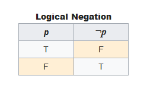
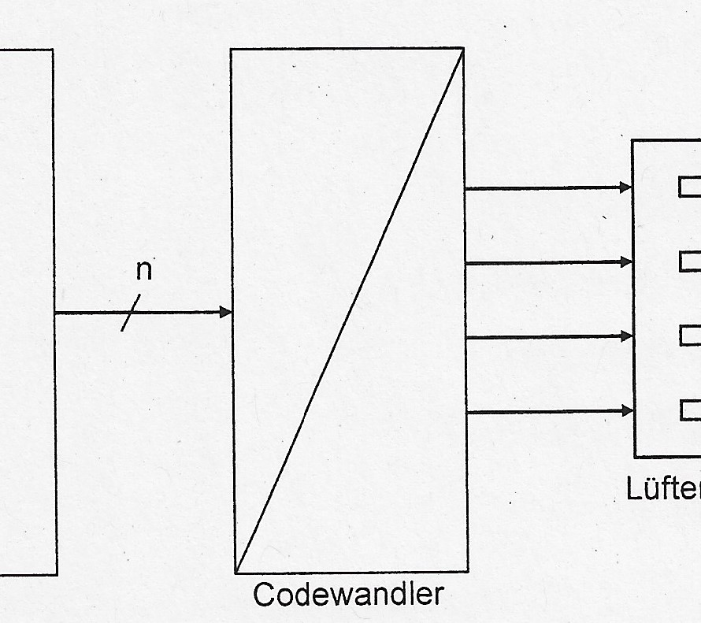
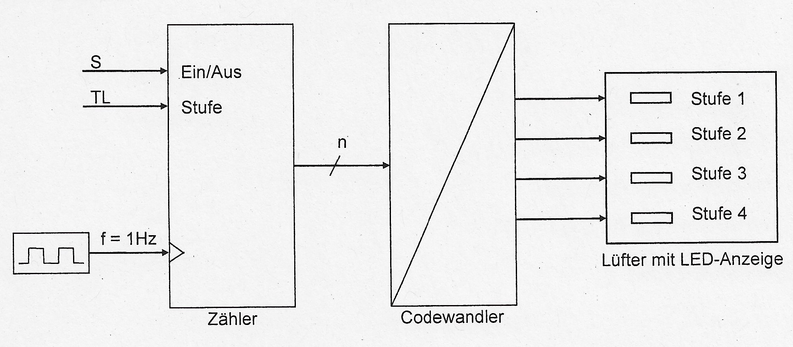

# TI-Cheatsheet

## Funktionstabelle / Truthtable / Wahrheitstabelle

Weitere Synonyme: `Wahrheitstafel`, `Wahrheitsmatrix`

`Bezeichnet eine Tabelle zur darstellung logischer zusammenhaenge. Meist genutzt in Schaltnetzen.` 

Quelle: [https://de.wikipedia.org/wiki/Wahrheitstabelle](https://de.wikipedia.org/wiki/Wahrheitstabelle)

## Ausgangsschaltnetz / Output logic

`Bezeichnet ein spezielles Schaltnetz das als Dekodierer/Codwandler funktioniert. Wird meist verwendet um ein Schaltwerk zu dekodieren` 

Quelle: Unterlagen

## Blockschaltbild  / Block diagram

`Bezeichnet eine graphische darstellung bei der nur die groben Technischen teile und ihre zusammen haenge dargestellt werden` 

Quellen: Unterlagen, [https://de.wikipedia.org/wiki/Blockschaltbild](https://de.wikipedia.org/wiki/Blockschaltbild)

## (Codierte) Zustandsfolgetabelle / (coded) Statetable
## Schaltwerk / Sequential logic
## Schaltnetz / Combinational logic